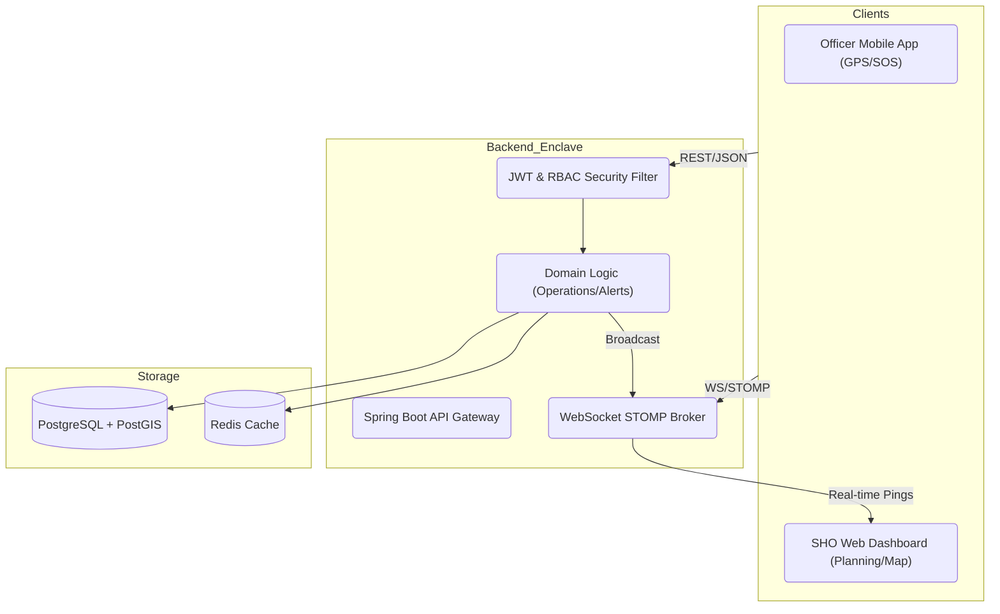
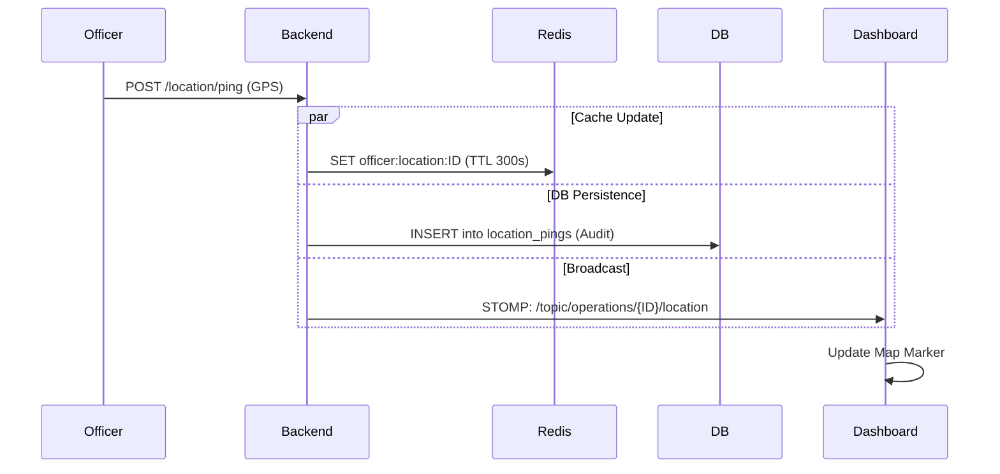
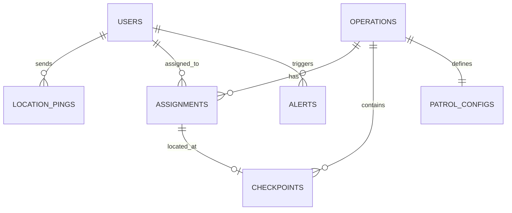

# CopMap Backend — Police Operations Management System

> Real-time patrolling and bandobast management platform for high-stakes field operations.

---

## 🚀 Quick Start (Docker)

```bash
git clone https://github.com/RohanAtole/copmap-backend.git
cd copmap
docker compose up --build
```

The API will be available at `http://localhost:8080`.

**Default admin credentials:**
- Badge Number: `ADMIN001`
- Password: `Admin@123` (Updated & Verified)

---

## 📺 Project Showcase
- **Technical Walkthrough (Architecture/DB/Logic):** [Read the WALKTHROUGH.md](WALKTHROUGH.md)
- **Architecture Video:** _(As an AI, I have provided the detailed textual walkthrough above; please record your own 5-10 min demo using that as a script.)_

---

## Table of Contents

1. [Research & Understanding](#1-research--understanding)
2. [Actor & Role Design](#2-actor--role-design)
3. [Architecture](#3-architecture)
4. [Data Design](#4-data-design)
5. [API Reference](#5-api-reference)
6. [Redis Usage](#6-redis-usage)
7. [Real-Time: WebSocket](#7-real-time-websocket)
8. [Implementation Scope](#8-implementation-scope)
9. [Trade-offs](#9-trade-offs)
10. [Docker Run Instructions](#10-docker-run-instructions)

---

## 1. Research & Understanding

### What is Patrolling?

Patrolling is the systematic movement of police officers through assigned geographic areas (called **beats**) to deter crime, maintain visibility, and respond to incidents. In India:

- **Beat officers** are assigned fixed zones — often a cluster of streets, markets, or residential blocks.
- A **beat constable** typically covers their beat on foot, bicycle, or motorcycle 2–4 times per shift.
- Patrols are planned by the **Station House Officer (SHO)** and documented in a **General Diary (GD)** at the station.
- The SHO or a Sub-Inspector monitors that officers are actually present in their beat (not sitting in the station).
- Key challenge: **Verifying physical presence** — GPS-based location tracking solves this.

### What is Bandobast?

Bandobast (literally "arrangement") refers to large-scale **event security deployment**. It is activated for:

- Political rallies, VIP visits (Z+ security)
- Religious processions (Eid, Ganesh Visarjan, Muharram)
- Republic Day / Independence Day parades
- Cricket matches, concerts

It involves deploying officers in **static posts** (nakas, gates, intersections) with specific duties. The **Superintendent of Police (SP) or DSP** creates the deployment order, which is a formal document listing each officer's post, duty hours, and reporting location.

### What is Nakabandi?

Nakabandi (checkpost/naka) is targeted **vehicle and person checking** at fixed points on roads. It serves:

- Drunk driving enforcement (random breath testing)
- Tracking criminals / wanted persons
- Contraband/stolen vehicle interception
- Border area surveillance

Officers are assigned to specific intersections or road stretches for defined time windows (e.g., 10 PM – 2 AM). A **naka report** documents every vehicle stopped.

### Real Workflow

```
SP/DSP (orders) → SHO (plans) → SI/ASI (supervises) → Constables (execute)
```

1. **Planning phase**: SHO creates the deployment order specifying who goes where
2. **Distribution**: Officers receive their orders (WhatsApp/notice board in practice)
3. **Deployment**: Officers acknowledge, reach their post, and mark attendance
4. **Monitoring**: Control room or duty officer monitors via radio + CopMap
5. **Closure**: SHO receives compliance report, updates General Diary

---

## 2. Actor & Role Design

### Roles

| Role | Who | Can Do |
|------|-----|--------|
| `SUPER_ADMIN` | SP / DySP / Range officer | Create users, view all stations, system config |
| `STATION_OFFICER` | SHO / Inspector / SI | Create + manage operations, assign officers, close ops, generate reports |
| `OFFICER` | Constable / HC | View own assignments, acknowledge, check-in/out, send location pings, trigger SOS |

### Authentication

- **Token type**: JWT (access) + rotating refresh token
- **Identity claim**: `badgeNumber` (unique police identifier)
- **Access token TTL**: 24 hours
- **Refresh token TTL**: 7 days, single-use (rotated on each use)
- **Session revocation**: Refresh token marked `revoked=true` on logout

---

## 3. Architecture

### System Architecture


### Data Flow: Real-time Location Tracking



### Service Boundaries (Microservice-Ready Design)

While implemented as a monolith for this task, the code is structured to split into these microservices:

| Service | Responsibility | Why Separate |
|---------|---------------|--------------|
| `auth-service` | Login, JWT, refresh tokens | Independent scaling, security isolation |
| `operation-service` | CRUD, lifecycle, assignments, reports | Core business domain |
| `location-service` | GPS pings, Redis cache, WebSocket | High-write throughput (1 ping/30s × N officers) |
| `alert-service` | Alert creation, SOS, offline detection | Event-driven, high availability needed |
| `notification-service` | FCM, email, WhatsApp | I/O-bound, easily replaceable |

---

## 4. Data Design

### Database Schema (ERD)



### Key Design Decisions

1. **`operations` is a single table** for PATROL, BANDOBAST, and NAKABANDI — the `type` column differentiates. Patrol-specific config lives in `patrol_configs` (1:1). This avoids JOIN complexity while keeping the schema normalized.

2. **Location pings are append-only** in PostgreSQL. The latest location is in Redis. This gives you a full movement trail for post-operation review while keeping live queries O(1).

3. **`audit_log` is immutable** — only `INSERT`, never `UPDATE`. Every state change is recorded with actor, timestamp, and before/after values.

4. **`assignments` has a composite UNIQUE constraint** on `(operation_id, officer_id)` — an officer cannot be assigned twice to the same op.

5. **JSONB for `alerts.metadata`** — allows storing flexible context (SOS coordinates, breach details, battery %) without schema changes.

### Key Tables

#### `operations`

```sql
type         | PATROL | BANDOBAST | NAKABANDI
status       | DRAFT → PUBLISHED → ACTIVE → COMPLETED | CANCELLED
shift_type   | MORNING | AFTERNOON | NIGHT | FULL_DAY
```

#### `assignments`

```sql
status       | PENDING → ACKNOWLEDGED → ON_DUTY → COMPLETED | ABSENT
```

#### Redis Keys

```
officer:location:{uuid}         → OfficerLocationResponse (TTL: 300s)
operation:officers:{uuid}       → Set<officerId> (TTL: 600s)
```

---

## 5. API Reference

Base URL: `http://localhost:8080/api/v1`

### Authentication

| Method | Endpoint | Auth | Description |
|--------|----------|------|-------------|
| POST | `/auth/login` | None | Login with badge + password |
| POST | `/auth/refresh` | None | Rotate refresh token |
| POST | `/auth/logout` | Bearer | Revoke current session |

### Operations

| Method | Endpoint | Auth | Description |
|--------|----------|------|-------------|
| POST | `/operations` | SO+ | Create operation |
| GET | `/operations` | Any | List station's operations |
| GET | `/operations/{id}` | Any | Get operation details |
| POST | `/operations/{id}/publish` | SO+ | DRAFT → PUBLISHED |
| POST | `/operations/{id}/start` | SO+ | PUBLISHED → ACTIVE |
| POST | `/operations/{id}/close` | SO+ | ACTIVE → COMPLETED |
| POST | `/operations/{id}/assignments` | SO+ | Assign officers |
| POST | `/operations/{id}/acknowledge` | Officer | Acknowledge assignment |
| POST | `/operations/{id}/check-in` | Officer | Mark on-duty |
| POST | `/operations/{id}/check-out` | Officer | Mark duty complete |
| GET | `/operations/{id}/report.pdf` | SO+ | Download PDF report |

### Location

| Method | Endpoint | Auth | Description |
|--------|----------|------|-------------|
| POST | `/location/ping` | Officer | Send GPS coordinates |
| GET | `/location/operations/{id}/live` | Any | Live map (from Redis) |
| GET | `/location/officers/{id}` | Any | Single officer location |
| POST | `/location/sos` | Officer | Trigger SOS alert |

### Users

| Method | Endpoint | Auth | Description |
|--------|----------|------|-------------|
| POST | `/users` | SO+ | Register new officer |
| GET | `/users` | SO+ | List users |
| GET | `/users/available?station=X` | SO+ | Available officers |
| GET | `/users/{id}` | Any | Get user |
| PATCH | `/users/{id}/status` | Admin | Suspend/activate user |

### Alerts

| Method | Endpoint | Auth | Description |
|--------|----------|------|-------------|
| GET | `/alerts/operations/{id}` | Any | Alerts for an operation |
| POST | `/alerts/{id}/acknowledge` | SO+ | Mark acknowledged |
| POST | `/alerts/{id}/resolve` | SO+ | Close alert |

### WebSocket Topics (STOMP)

Connect to: `ws://localhost:8080/ws`

| Destination | Direction | Payload | Description |
|-------------|-----------|---------|-------------|
| `/topic/operations/{id}/location` | Server→Client | `OfficerLocationResponse` | Real-time GPS update |
| `/topic/operations/{id}/status` | Server→Client | `{status, updatedAt}` | Status change |
| `/topic/operations/{id}/alerts` | Server→Client | Alert summary | New alert in operation |
| `/topic/alerts/global` | Server→Client | Alert summary | Station-wide alerts |

---

## 6. Redis Usage

### Why Redis?

| Use Case | Alternative | Why Redis Wins |
|----------|-------------|----------------|
| Live officer location | Polling DB every 5s | O(1) GET vs O(log N) DB query; no table scan |
| Online detection | Scheduled DB query | TTL expiry is automatic — no cron needed |
| Officer set per op | JOIN query | Pure in-memory, sub-ms response |

### Pattern: Live Location Cache

```
POST /location/ping

Officer GPS data
     │
     ├──► PostgreSQL INSERT (audit trail, append-only)
     │
     ├──► Redis SET officer:location:{id} <json> EX 300
     │         (5-min TTL: if no ping arrives, key vanishes → officer offline)
     │
     └──► Redis SADD operation:officers:{opId} {officerId}
               (track which officers are on this op)
```

```
GET /location/operations/{id}/live

Redis SMEMBERS operation:officers:{id}
     │
     └──► For each officerId:
           Redis GET officer:location:{officerId}
           → check TTL still exists → isOnline=true/false
```

**Offline Detection**: A background job runs every 60s. It checks all officer IDs registered for active operations and tests `EXISTS officer:location:{id}`. If the key has expired (TTL hit 0), the officer hasn't pinged in 300s → create OFFICER_OFFLINE alert.

---

## 7. Real-Time: WebSocket

Using **STOMP over SockJS**:

- **STOMP** provides structured publish/subscribe semantics over WebSocket
- **SockJS** provides a fallback transport (long polling) for restrictive networks

```javascript
// Frontend usage
const client = new Client({
  webSocketFactory: () => new SockJS('http://localhost:8080/ws')
});

client.onConnect = () => {
  // Subscribe to live map for an operation
  client.subscribe('/topic/operations/{id}/location', (msg) => {
    const location = JSON.parse(msg.body);
    updateMapMarker(location.officerId, location.latitude, location.longitude);
  });
  
  // Subscribe to alerts
  client.subscribe('/topic/operations/{id}/alerts', (msg) => {
    showAlertToast(JSON.parse(msg.body));
  });
};
```

### Production Note

For multi-node deployment, replace the in-memory simple broker with a Redis Pub/Sub relay:
```java
registry.enableStompBrokerRelay("/topic", "/queue")
    .setRelayHost("redis-host")
    .setRelayPort(6379);
```

---

## 8. Implementation Scope

### ✅ Implemented

- **Full Auth Stack**: JWT login/refresh, BCrypt hashing, and dynamic role-based access.
- **Operation Lifecycle**: Full state machine (DRAFT → PUBLISHED → ACTIVE → COMPLETED).
- **Hybrid Storage**: PostgreSQL for audit trails + Redis for sub-millisecond live map lookups.
- **Geospatial Readiness**: Integrated **PostGIS** extension for spatial indexing.
- **Security Engineering**: Resolved circular dependency between SecurityConfig and Auth filters using `@Lazy` injection.
- **Real-time SOS**: Integrated alert system with last-known coordinate metadata.
- **Automated Detection**: Background jobs for officer connectivity monitoring & overdue operations.

### ❌ Consciously Skipped

| Feature | Reason |
|---------|--------|
| Swagger/OpenAPI docs | Time constraint; Comprehensive **Postman Collection** provided instead. |
| Rate limiting | Production scale would implement this via Cloud Gateway or Nginx. |
| FCM Live Integration | Stubbed service provided; requires active Firebase production keys. |
| DB Partitioning | Current scale doesn't require partitioned location history tables. |


---

## 9. Trade-offs

### Docker Environment Stability
**Trade-off**: Switched from vanilla Postgres to **PostGIS** alpine image.
**Reasoning**: Real-world police operations require spatial distance calculations. Initial builds failed because the vanilla image lacked spatial extensions used in schema migrations.

### Security Circular Dependency
**Problem**: SecurityConfig needed the JWT Filter, and the JWT Filter needed the UserDetailsService defined in SecurityConfig.
**Solution**: Applied `@Lazy` injection to break the instantiation loop, ensuring the Filter Chain initializes regardless of the order of bean creation.

### Schema Validation vs INET Types
**Trade-off**: Explicitly defined `columnDefinition = "inet"` for Postgres in Java mappings.
**Reasoning**: Hibernate's default schema validation crashes when it expects a `VARCHAR` but sees a Postgres-specific `INET` type. Sacrificed JPA vendor neutrality for high-performance network tracking.

---


## 10. Docker Run Instructions

### Prerequisites
- Docker Desktop installed and running
- Ports 8080, 5432, 6379 available

### Run

```bash
# 1. Clone and enter
git clone <repo-url>
cd copmap

# 2. Start all services
docker compose up --build

# 3. Wait for healthy status (first run downloads base images)
# Watch for: "Started CopmapApplication in X seconds"

# 4. Verify health
curl http://localhost:8080/actuator/health
```

### Environment Overrides

Create a `.env` file in the `copmap/` directory:

```env
JWT_SECRET=your-very-long-secret-key-here
NOTIFICATION_MOCK=false
MAIL_HOST=smtp.gmail.com
MAIL_USER=your@email.com
MAIL_PASS=app-password
CORS_ORIGINS=https://your-frontend.com
```

Then:
```bash
docker compose --env-file .env up
```

### Stopping

```bash
docker compose down          # stop containers
docker compose down -v       # stop + delete volumes (fresh DB)
```

### Logs

```bash
docker compose logs -f copmap-backend
docker compose logs -f postgres
docker compose logs redis
```

---

## Tech Stack

| Component | Technology | Version |
|-----------|-----------|---------|
| Framework | Spring Boot | 3.2.5 |
| Language | Java | 17 |
| ORM | Spring Data JPA + Hibernate | 6.x |
| DB | PostgreSQL | 15 |
| Cache | Redis (Lettuce) | 7 |
| Auth | JWT (jjwt) | 0.11.5 |
| WebSocket | Spring WebSocket + STOMP + SockJS | — |
| Migrations | Flyway | — |
| PDF | iText7 | 7.2.5 |
| Build | Maven | 3.9 |
| Containerization | Docker + Compose | — |
| Testing | JUnit 5 + Spring Boot Test | — |
